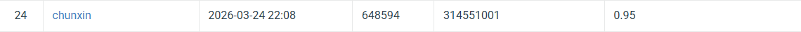

# NYCU Computer Vision 2026 HW1

- **Student ID:** 314551001
- **Name:** Tan Chun Xin

## Introduction

This repository implements a 100-class image classification model for the NYCU CV HW1 competition on CodaBench.

The model, `MultiScaleResNet`, is built on a pretrained **ResNet-152** backbone with three enhancements:

1. **CBAM** (Convolutional Block Attention Module) injected into every Bottleneck block — re-weights channel and spatial responses after each residual unit.
2. **Non-Local self-attention blocks** after layer3 and layer4 — capture long-range spatial dependencies that local convolutions miss.
3. **Multi-scale GeM pooling with Scale Attention** — pools features from layer2, layer3, and layer4 separately using Generalised Mean (GeM) pooling, then gates the concatenated descriptor with an SE-style attention module.

Training uses aggressive data augmentation (RandAugment, MixUp, CutMix, RandomErasing) and a three-tier learning-rate schedule with cosine annealing. Total parameters: ~73 M (within the 100 M limit).

## Environment Setup

Python 3.9 or higher is recommended.

Install dependencies:

```bash
pip install -r requirements.txt
```

`requirements.txt`:

```
torch>=2.0.0
torchvision>=0.15.0
tqdm
matplotlib
pandas
Pillow
```

## Usage

### Training

Place the dataset under `cv_hw1_data/` with the following structure:

```
cv_hw1_data/
├── train/
│   ├── 0/
│   ├── 1/
│   └── ...
├── val/
│   ├── 0/
│   ├── 1/
│   └── ...
└── test/
    ├── 00001.jpg
    └── ...
```

Run training:

```bash
python train5.py
```

The best model checkpoint will be saved as `best_model3.pth` and training curves will be saved as `training_curves.png`.

### Inference

Run inference on the test set:

```bash
python test_train5.py
```

This loads `best_model3.pth`, generates `prediction.csv`, and compresses it into `solution3.zip` for submission to CodaBench.

## Performance Snapshot

| Model | Val Acc (%) | Public Score |
|---|---|---|
| ResNet-152 (baseline) | 92.00 | 0.93 |
| + CBAM | 92.67 | 0.94 |
| + CBAM + Non-Local (layer3 only) | 93.00 | 0.94 |
| + CBAM + Non-Local (layer3+4) + Multi-scale | 93.00 | 0.95 |
| **+ Scale Attention (ours, final)** | **94.00** | **0.95** |


